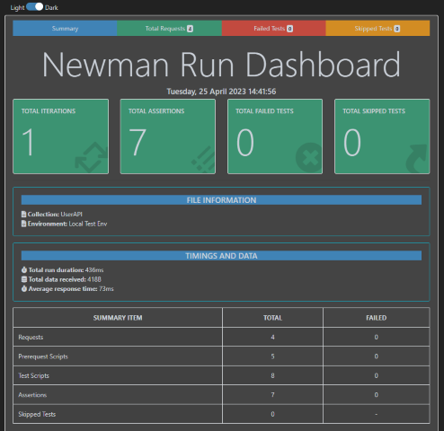

# Assignment 2 - Web API.

Name: Joshua Miron

## Features.

[A bullet-point list of the ADDITIONAL features/endpoints you have implemented in the API **THAT WERE NOT IN THE LABS** ]. 

+ From the labs (I believe), but were ported over to the Movies App:
    + Signup (Create accout)
    + Login
    + GetMovies
    + GetMovie (a parameterized route)
    + Joi validation on the password strength and email address format
    + Possibly some other stuff I'm forgetting

+ NEW Accounts endpoints
    + Get an account by email address (used for identifying the logged in account for various things)
    + Update favourite movies
        + a PUT that adds or deletes depending on whether the record already exists in the array
    + Update movies playlist
        + a PUT that adds or deletes depending on whether the record already exists in the array
    + Update favourite people
        + a PUT that adds or deletes depending on whether the record already exists in the array
    + Add and Remove made-up movie
        + a PUT and DELETE, that creates or delets a NESTED DOCUMENT under the user account
+ Assorted TMDB endpoints proxied through the API, routed under Movies, People and TV respectively
    + getUpcomingMovies
    + getPopularMovies
    + getTrendingMovies
    + getGenres (used for filtering, displaying along with movie's details)
    + get Movie Images (displayed with movie's details)
    + get Movie Credits (displayed with movie's details)
    + get Similar Movies (displayed with movie's details)
    + get Recommended Movies (displayed with movie's details)
    + get Movie Reviews (a parameterized route, displayed in drawer from movie details)
    + get Trending People
    + get Popular People
    + get Person (a parameterized route, similar to getMovie)
    + get Person Images (displayed with person details)
    + get Person's MOvie Credits (displayed with person details)
    + get TV Shows
    + get TV Show (a parameterized route, similar to getMovie)
    + get TV Show Images (displayed with person details)

+ Creating account specific lists of a list of Favourite Movies, a Movies Playlist, and a list of Favourite People that attaches to the user account, so if you switch accounts or log out / log in the correct list is displayed for the logged in user.  The lists are saved both in the database and in the local context, which is reset and refreshed when a user logs out or logs in, to keep them in sync with the database.
+ Added "made-up movie" records as a nested document attached to the user account, so it displays correctly through log out / log in for the logged in user.  It is also in both the database and the local context and reset and refreshed when a user logs out or logs in. 
+ The various list type pages paginate, passing the requested page through to the API
+ Error messaging on the login page if the user credentials don't authenticate.
+ Site Header's sign in menu is contextual.
    + If you are not authenticated it displays Sign In with menu items of Log In and Create New Account under it.
    + If you are authenticated it displays an avatar with the authenticated users initials with the menu item Log Out under it.
+ Attempting to navigate to Private Routes redirects you to Sign In when not authenticated.
+ Attempting to Favourite a movie (or do other similar tasks) when not authenticated displays a modal prompting you to sign in.
+ Movie Details displays
    + Various details about the movie
    + Other posters for this movie (get Movie Images)
    + The cast of the movie with image, actor's name and character name, that links to each person's details (get Movie Credits)
    + A list of similar movies with image that links to each movie's details
    + A list of recommended movies (based on current movie) with image that links to each movie's details
+ TV Show Details displays
    + Various details about the show
+ Person Details displays
    + Various details about the person
    + Other photos of the person (get Person Images)
    + A list of movies the person has been in (get Person Credits) with image that links to each movie's details
## Installation Requirements

The API was built in a Codespace.  I imagine you can fork or clone the project and create a new codespace to run it.

The front end is a separate project, available here: https://github.com/joshuamiron/labMoviesApp_proxied.

## API Configuration

If you download the API for your own use, you will need to create a .env file in the root of the project with a few things in it:
+ You will need to create a (free) TMDB developer account and get a TMBD API key, and add that key to the .env file.
+ Since the front-end project has proxy URL of 8080 hardcoded into its vite.config.js file, you will need to set the port in the .env file to 8080 an dmake sure you don't have any other application running on that port.
+ For salting/hashing of passwords and the creation of tokens, you will need to add a JWT secret key.
+ You will also need to install MongoDB (per the labs), and define its URL in the .env file.

Your .env file should look something like this:

```bat
TMBD_KEY=[Your TMBD Key]
NODE_ENV=development
PORT=8080
HOST=localhost
DATABASE_DIALECT=mongo
DATABASE_URL=mongodb://localhost:27017/movies_db
JWT_SECRET_KEY=[Your secret key - basically anything you like]
```


## API Design
[Give an overview of your web API design, perhaps similar to the following: ]

|  |  GET | POST | PUT | DELETE
| -- | -- | -- | -- | -- 
| /api/movies |Gets a list of movies | N/A | N/A |
| /api/movies/{movieid} | Get a Movie | N/A | N/A | N/A
| /api/movies/{movieid}/reviews | Get all reviews for movie | Create a new review for Movie | N/A | N/A  
| ... | ... | ... | ... | ...

[If you have your API design on an online platform or graphic, please link to it (e.g. [Swaggerhub](https://app.swaggerhub.com/)).]
https://app.swaggerhub.com/apis-docs/fxwalsh/userAPI/initial


## Security and Authentication
[Give details of authentication/ security implemented on the API(e.g. passport/sessions). Indicate which routes are protected. **REMEMBER: DON'T PUT YOUR OWN USERNAMES/PASSWORDS/AUTH KEYS IN THE README OR ON GITHUB]**

[Give details of the routes that have authentication. ]


## Validation

[Briefly describe and extra data validation you added to the API, and where it is implemented in the App.]


## Testing

Briefly state how you tested the API. 

Give an example of any automated testing results or link to a report. 



## Integrating with React App

[Describe how you integrated your React app with the API. You can provide a link to the React App repo and give an example of an API call from React App. For example: ]

~~~Javascript
export const getMovies = () => {
  return fetch(
     '/api/movies',{headers: {
       'Authorization': window.localStorage.getItem('token')
    }
  }
  ).then((res) => res.json());
};

~~~

[You can also add images of React app here also if you wish. This can be also shown in the video]

## Extra features

. . Briefly explain any non-standard features, functional or non-functional, developed for the app.  

If you deployed to a hosting service/cloud, you should specify here. 

## Independent learning.

. . State the non-standard aspects of React/Express/Node (or other related technologies) that you researched and applied in this assignment . .  
