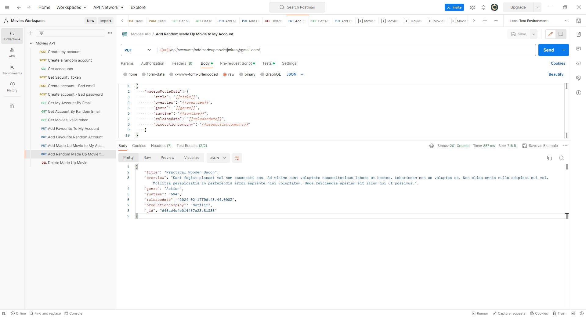
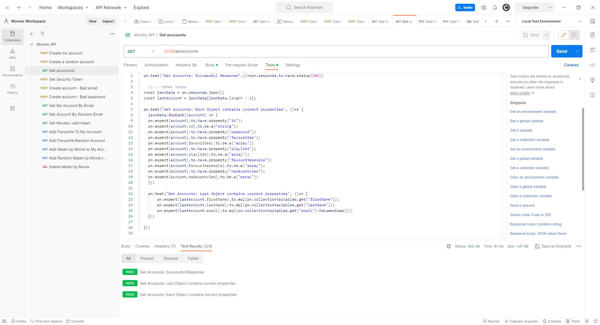
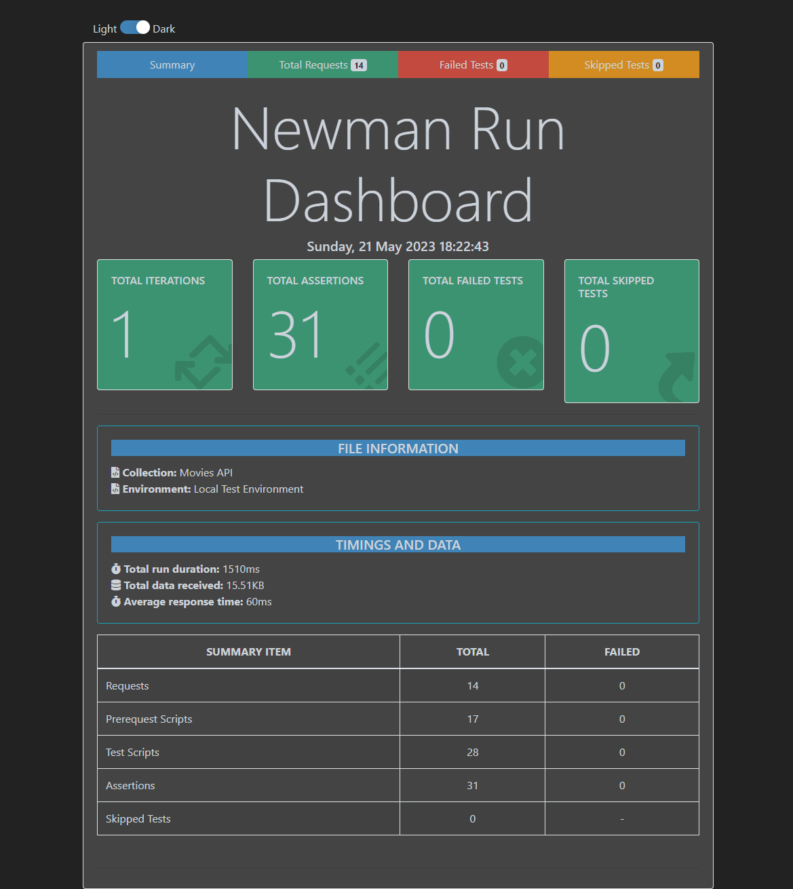
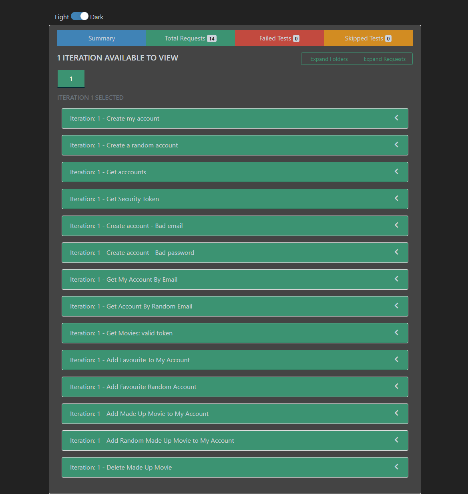
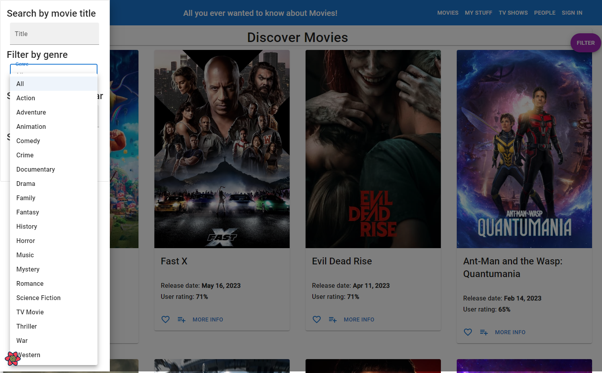

# Assignment 2 - Web API.

Name: Joshua Miron

## Features.

+ From the labs, ported over to the Movies App:
    + Sign up (Create account), Log in, Get movies, Get movie
    + Joi validation on the password strength and email address format

+ New Mongo endpoints for Accounts:
    + Get an account by email address (used for identifying the logged in account for various things)
    + Update favourite movies
        + a PUT that adds or deletes depending on whether the record already exists in the array
    + Update movies playlist
        + a PUT that adds or deletes depending on whether the record already exists in the array
    + Update favourite people
        + a PUT that adds or deletes depending on whether the record already exists in the array
    + Add and Remove made-up movie
        + a PUT and a DELETE that creates or deletes a nested document under the user account

+ Assorted TMDB endpoints proxied through the API, routed under Movies, People and TV respectively:
    + get Upcoming Movies
    + get Popular Movies
    + get Trending Movies
    + get Movie Genres (used for filtering, displaying along with movie's details)
    + get Movie Images (displayed with movie's details)
    + get Movie Credits (displayed with movie's details)
    + get Similar Movies (displayed with movie's details)
    + get Recommended Movies (displayed with movie's details)
    + get Movie Reviews (a parameterized route, displayed in drawer from movie details)
    + get Trending People
    + get Popular People
    + get Person (a parameterized route, similar to getMovie)
    + get Person Images (displayed with person details)
    + get Person's Movie Credits (displayed with person details)
    + get TV Shows
    + get TV Show (a parameterized route, similar to getMovie)
    + get TV Show Images (displayed with person details)

+ Other features of note:
    + Ability to create account specific lists of Favourite Movies, a Movies Playlist, and of Favourite People that attach to the user account, so if you switch accounts or log out / log in, the user specific list is displayed for the logged in user.
        + The lists are saved both in the database and in the local context, which is reset and refreshed when a user logs out or logs in, to keep them in sync with the database.
    + Added "made-up movie" records as a nested document attached to the user account, so it displays correctly through log out / log in for the logged in user.  It is also in both the database and the local context and reset and refreshed when a user logs out or logs in. 
    + All the various list type pages paginate, passing the requested page number through to the API
    + Error messaging on the login page if the user credentials don't authenticate.
    + Site Header's sign in menu is contextual.
        + If you are not authenticated it displays **Sign In** with menu items of **Log In** and **Create New Account** under it.
        + If you are authenticated it displays an avatar with the authenticated users initials with the menu item **Log Out** under it.
    + Attempting to navigate to user specific Private Routes redirects you to Sign In when not authenticated.
    + Attempting to Favourite a movie (or do other similar tasks) when not authenticated displays a modal prompting you to sign in.
    + Movie Details displays
        + Various details about the movie
        + Other posters for this movie (get Movie Images)
        + The cast of the movie with image, actor's name and character name, that links to each person's details (get Movie Credits)
        + A list of similar movies with image that links to each movie's details
        + A list of recommended movies (based on current movie) with image that links to each movie's details
    + TV Show Details displays
        + Various details about the show
    + Person Details displays
        + Various details about the person
        + Other photos of the person (get Person Images)
        + A list of movies the person has been in (get Person Credits) with image that links to each movie's details

## Installation Requirements

The API was built in a Codespace.  You can fork or clone the project and create a new codespace to run it.

The front end is a separate project, available here: https://github.com/joshuamiron/labMoviesApp_proxied.

## API Configuration

If you download the API project for your own use, you will need to create a .env file in the root of the project with a few things in it:
+ You will need to create a (free) TMDB developer account and get a TMDB API key, and add that key to the .env file.
+ Since the front-end project has proxy URL of 8080 hardcoded into its vite.config.js file, you will need to set the port in the .env file to 8080 and make sure you don't have any other application running on that port.  (Or you can alter the port number in teh front-end project.)
+ For salting/hashing of passwords and the creation of tokens, you will need to add a JWT secret key.
+ You will also need to install MongoDB (per the labs), and define its URL in the .env file.

Your .env file should look about like this:

```bat
TMBD_KEY=[Your TMBD Key]
NODE_ENV=development
PORT=8080
HOST=localhost
DATABASE_DIALECT=mongo
DATABASE_URL=mongodb://localhost:27017/movies_db
JWT_SECRET_KEY=[Your secret key - basically anything you like]
```

## API Design
### Accounts
| ROUTE |  GET | POST | PUT | DELETE
| -- | -- | -- | -- | -- 
| /api/accounts | Get a list of accounts | Creates a new account | --- | --- |
| /api/accounts/security/token | --- | Authenticate the user logging in | --- | ---
| /api/accounts/getaccount/${email} | Get all of one account's details | --- | --- | ---  
| /api/accounts/updatefavourites/${email} | --- | --- | Add or delete a movie from a user's favourites | ---
| /api/accounts/updateplaylist/${email} | --- | --- | Add or delete a movie from a user's playlist | ---
| /api/accounts/updatefavouritepeople/${email} | --- | --- | Add or delete a person from a user's favourites | ---
| /api/accounts/addmadeupmovie/${email} | --- | --- | Add a made-up movie as a nested document to a user's list | ---
| /api/accounts/addmadeupmovie/${email} | --- | --- | --- |  Delete a made-up movie from a user's list

### Movies
| ROUTE |  GET | POST | PUT | DELETE
| -- | -- | -- | -- | -- 
| /api/movies/?page=${page} | Get a list of movies by page number | --- | --- | --- |
| /api/movies/${id} | Get the details of a specific movie | --- | --- | ---
| /api/movies/${id}/images | Get all the posters for a movie | --- | --- | ---
| /api/movies/upcoming?page=${page} | Get a list of upcoming movies by page number | --- | --- | ---
| /api/movies/popular?page=${page} | Get a list of popular movies by page number | --- | --- | ---
| /api/movies/trending?page=${page} | Get a list of trending movies by page number | --- | --- | ---
| /api/movies/genre | Get a list of all movie genres | --- | --- | ---
| /api/movies/${id}/credits | Get a list of the movie's cast | --- | --- | ---
| /api/movies/${id}/similar | Get a list of movies "similar" to the current movie | --- | --- | ---
| /api/movies/${id}/recommended | Get a list of recommended movies based on the current movie | --- | --- | ---
| /api/movies/${id}/reviews | Get a list reviews for the current movie | --- | --- | ---

### People
| ROUTE |  GET | POST | PUT | DELETE
| -- | -- | -- | -- | -- 
| /api/people/trending?page=${page} | Get a list of trending people by page number | --- | --- | --- |
| /api/people/popular?page=${page} | Get a list of popular people by page number | --- | --- | ---
| /api/people/${id} | Get the details of a specific person | --- | --- | ---
| /api/people/${id}/images | Get all the photos of a person | --- | --- | ---
| /api/people/${id}/movie_credits | Get all the movie credits for a person | --- | --- | ---

### TV
| ROUTE |  GET | POST | PUT | DELETE
| -- | -- | -- | -- | -- 
| /api/tv/shows?page=${page} | Get a list of TV shows by page number | --- | --- | --- |
| /api/tv/${id} | Get the details of a specific TV show | --- | --- | ---
| /api/tv/${id}/images | Get all the posters for a TV show | --- | --- | ---

## Security and Authentication
Any page that would display user specific information is marked as a private route and redirects the unauthenticated user to the login page.  This includes:

+ My Stuff / Favourite Movies
+ My Stuff / My Movie Playlist
+ My Stuff / My Made Up Movies
+ My Stuff / Favourite People

Any card (movie card, person card, tv show card) that has a card action on it to favourite or add to a playlist displays a modal explaining that you need to sign in to perform this action if the user is unauthenticated, and provides a link to the sign in page.


## Validation

I ported over the validation done in the labs, that a first and last name were required, that an email address had to be in the format of an email address, and that a password had to be a certain length and have a pattern that included numbers, upper and lower case letters and a certain subset of symbols.

## Testing

I'd generally use the Postman requests to validate that I had a request built correctly, before attempting to integrate it into the front-end app.

I built requests for 14 of the API calls.  Some of the calls are very similar (i.e. Movie Details and TV Show Details) and since they were obviously working in the front-end, I didn't build calls for all fo them.

Some of the calls I built in duplicate, using both hardcoded and random data from faker.

Here is an example of the Pre-request script for the Made-up Movie call:

pm.collectionVariables.set("title", pm.variables.replaceIn('{{$randomProductName}}'))
pm.collectionVariables.set("overview",pm.variables.replaceIn('{{$randomLoremSentences}}'))
pm.collectionVariables.set("genre", "Action")
pm.collectionVariables.set("runtime",pm.variables.replaceIn('{{$randomInt}}'))
pm.collectionVariables.set("releasedate", pm.variables.replaceIn('{{$randomDateFuture}}'))
pm.collectionVariables.set("productioncompany","Netflix")

Here is the (kind of funny) resulting body:

{
    "title": "Practical Wooden Bacon",
    "overview": "Sunt fugiat placeat vel non occaecati eos. Ad minima sunt voluptate necessitatibus labore et beatae. Laboriosam non ea voluptas ex. Non alias omnis nulla adipisci qui vel. Mollitia perspiciatis in perferendis error sapiente nisi voluptatum. Unde reiciendis aperiam sit illum qui ut possimus.",
    "genre": "Action",
    "runtime": "694",
    "releasedate": "2024-02-17T06:43:44.000Z",
    "productioncompany": "Netflix",
    "_id": "646ad4c4e0f4467a23c81333"
}



I also built tests for most of the Postman requests. Here is an example of one of the more complicated ones, for getAccounts where I am validating general structure of the each account in the array as well as specific details of the last randomly added account.



Per the labs, I also integrated Newman and ran all the tests as a batch.





## Integrating with React App

Per the lectures and labs, I integrated the Movies React app with the API project by proxying it via the vite.config.js like so:

~~~Javascript

import { defineConfig } from 'vite'
import react from '@vitejs/plugin-react'

// https://vitejs.dev/config/
export default defineConfig({
  plugins: [react()],
  server: {
    port: 5173,
    proxy: {
      '/api': {
        target: 'http://127.0.0.1:8080',
        changeOrigin: true,
        secure: false
      }
    }
  },
})

~~~

The Movies React app repo is available here: https://github.com/joshuamiron/labMoviesApp_proxied. (I created a second instance of it so as to preserve the work from assignment 1 unaltered.)

The API calls flowed from various components or pages to the client-side API to the server side routes, controllers and services.

For example, the client-side component filterMoviesCard/index.jsx imports the getGenres API call in order to be able to filter the list of movies by genre like so...

~~~Javascript
import { getGenres } from "../../api/api";
~~~

... calls it later in the component like so...
~~~Javascript
export default function FilterMoviesCard(props) {
  const { data, error, isLoading, isError } = useQuery("genres", getGenres);
  ~~~

... and the client-side API call we imported that ultimately calls the server-side route looks like this:
~~~Javascript
export const getGenres = async () => {
  const res = await fetch(`/api/movies/genres`, {
    headers: {
      Authorization: window.localStorage.getItem("token"),
    },
  });
  return await res.json();
};
  ~~~



## Extra features

Pretty much described above:
+ Lots of endpoints, both Mongo and proxied TMDB
+ Several parameterized URLs
+ GET, POST, PUT, DELETE endpoints
+ Nested documents
+ Joi validation
+ Authentication and private routes
+ Tried to include good error handling everywhere
+ Extenstive and realistic integration with the React App, i.e.:
    + All TMDB calls from Assignment 1 were ported to the API
    + All account specific data is coming from the API / MongoDB
    + Tried to build functionality you'd realistically want on the front end, in a well conceived and well presented manner
+ Logging and testing

## Independent learning.

I did attempt to deploy it to Vercel, but apparently Vercel doesn't natively support Express APIs and you have to do quite a bit of rework to make it serverless, so that didn't happen.

However, if you want to see where it ended up, it is available here:
API: ewd-api-labs-2023-fangq312j-joshuamiron.vercel.app
Front-end: lab-movies-app-proxied-lllzjw39v-joshuamiron.vercel.app

I also took at stab at Swagger, but didn't get very far.  But if you notice a swagger.json file lying around in the project it is because of that.